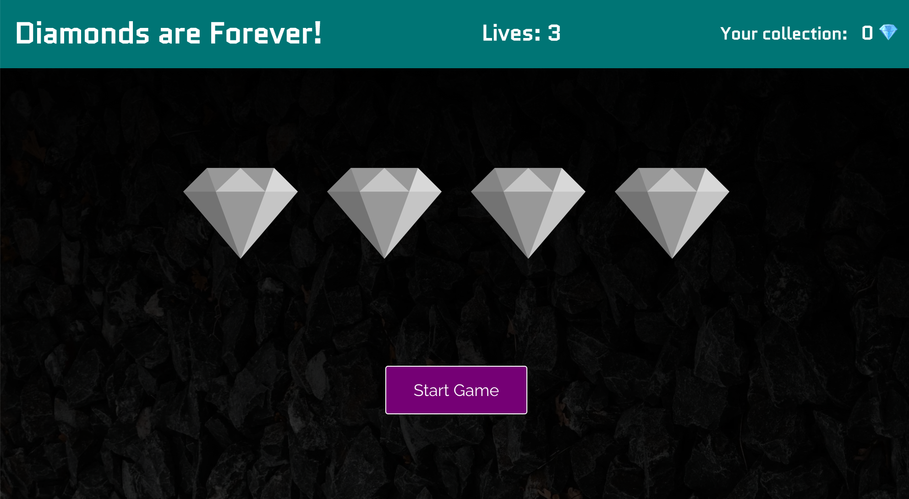

# Diamonds are Forever | Speed Game on React

## This is a classroom project for Fullstack Web Developer Program (React & Node) at BCH, Helsinki.

### Created with ❤️ on

- HTML
- CSS
- JavaScript
- React

### ScreenShot

### Instructions for Game

1. The the purpose of this game is to collect as much as diamonds by clicking active (shined) diamonds.
2. Player has 3 lives at the beginning.
3. On every missed click or, failing to pick a diamond, user looses one life. The game is over when all 3 lives spent.
4. The speed of diamond shining increases every moment so, be quick.

### Happy mining ⛏️&nbsp;!

&mdash; Vijay
